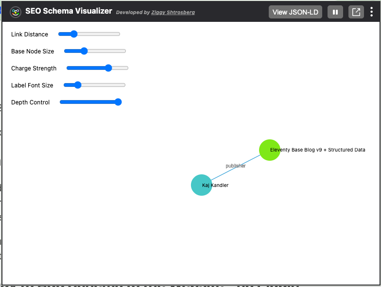

We can add schema markup in our global template so it is included in any page.

## Why not use a Plugin for Schema Markup

You could add schema to your website using the "[eleventy-plugin-schema](https://github.com/quasibit/eleventy-plugin-schema)" but I did not find it too useful. The plugin restricts me to predefined Entity types and properties. My needs for schema are comprehensive and I want to stay flexible.

The Plugin "[simply-schema-eleventy](https://github.com/PauTym/simply-schema-eleventy/)" removes the restrictions, yet it still overly complicates things in my view.

## Strategy to Add Schema to the Website - no Plugin required

My approach simply adds the schema to the front matter and dumps it as JSON into the base layout.

## 1. Define Global Schema as Global Data

In a global data file at `_data/eleventyComputed.js` I build up a tree under `schemaorg` with the raw schema I need.

for example:


```js
export default {
  schemaorg: {
    "@context": "https://schema.org",
    "@graph": [
      {
        "@type": "WebSite",
        "@id": (data) => `${data.metadata.url}#website`,
        name: (data) => data.metadata.title,
        description: (data) => data.metadata.description,
        url: (data) => data.metadata.url,
        publisher: {
          "@type": "Person",
          "@id": (data) => `${data.metadata.url}/#person_kaj_kandler`
        },
      }
        ]
    }
}
```


Add the graph under eleventyComputed because I want to integrate with the metadata structure already defined by the base-blog starter project.

### Why use a "@graph" collection for the schema?

If you use a "@graph" you can assemble the schema nicely at various levels. The eleventy data cascade merges the data from global, folder level and file level nicely into something that you want.

If you would start with a top level object you would have to inject nested objects into the tree, making the entire structure much more ridged and opinionated. See also [the explanation by Yoast](https://academy.yoast.com/app/uploads/sites/4/2020/11/2-1-the-yoast-seo-graph-structured-data-for-beginners.pdf), a well known Schema Plugin for Wordpress.

## 2. Inject Schema into All Pages at the Base Template

We want the schema to go into the header of all pages. Therefore we inject it into your base layout template.

If we build the schema graph with simple front matter, we can dump it as JSON into the header of our `_includes/layouts/base.njk` template like this:


```html
{# Add schema.org structured data as JSON-LD #}
<script eleventy:ignore type="application/ld+json">{{ schemaorg | dump(\t) | safe }}</script>
```


> **Note:**
>
> We must use the `eleventy:ignore` attribution or the script will be combined with other java script. 

This behavior is caused by the config in the `eleventy.config.js`:


```js
	// Bundle <script> content and adds a  paired shortcode
	eleventyConfig.addBundle("js", {
		toFileDirectory: "dist",
		// Add all <script> content to the `js` bundle (use eleventy:ignore to opt-out)
		// supported selectors: https://www.npmjs.com/package/posthtml-match-helper
		bundleHtmlContentFromSelector: "script",
	});
```


## What Entities to Generate Globally?

An entities in Schema is anything that has an ID. Most entities also have a "@type" from the schema.org vocabulary.

Any Website has an object of type Website, i.e. `"@type": "Website"`

Also a website has a publisher. This may be a person for a personal blog or an organization.

Here is my complete global data:


```js
export default {
  schemaorg: {
    "@context": "https://schema.org",
    "@graph": [
      {
        "@type": "WebSite",
        "@id": (data) => `${data.metadata.url}#website`,
        name: (data) => data.metadata.title,
        description: (data) => data.metadata.description,
        url: (data) => data.metadata.url,
        publisher: {
          "@type": "Person",
          "@id": (data) => `${data.metadata.url}/#person_kaj_kandler`
        },
      },
      {
        "@type": "Person",
        "@id": (data) => `${data.metadata.url}/#person_kaj_kandler`,
        "name": "Kaj Kandler",
        "url": "https://kajkandler.com/",
        "givenName": "Kaj",
        "familyName": "Kandler",
        "jobTitle": "Entrepreneur",
        "sameAs": [
          "https://www.linkedin.com/in/kajkandler/",
          "https://github.com/KajKandler",
          "https://medium.com/@kajkandler",
          "https://entitygarden.com/about_kaj_kandler/"
        ]
      }
    ]
  }
}
```


## Connecting all Entities to a Single Graph

Take not how the `Website` has a property `publisher`, which is a reference to an entity of type "Person" and an "@id".

These two properties are exactly the same as the second entity in the graph, the `Person` entity.

This is the way how to connect two entities.



